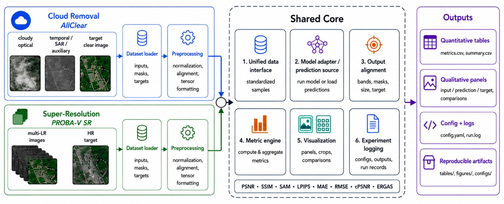

# Satellite Deep-Learning Evaluation Pipeline

A unified benchmark pipeline for evaluating satellite image deep-learning models, supporting **super-resolution** (Proba-V) and **cloud removal** (AllClear) tasks.



---

## Supported Datasets & Models

| Dataset | Task | Valid `--model` values |
|---|---|---|
| `probav` | Super-resolution | `bicubic`, `median`, `rams` |
| `allclear` | Cloud removal | `leastcloudy`, `mosaicing`, `uncrtaints` |

---

## Basic Usage

```bash
python -m cli.main --dataset [DATASET] --model [MODEL] --data_path [PATH]
```

**Core arguments:**

- `--dataset` — Dataset to evaluate. Choices: `probav`, `allclear`. Default: `probav`
- `--model` — Model to run (must match the dataset's task — see table above). Default: `bicubic`
- `--data_path` — Path to the dataset. For Proba-V this is the root folder; for AllClear this is the JSON metadata file.
- `--n_scenes` — Number of scenes to evaluate. Omit or pass `-1` to run the full dataset.
- `--metrics` — Metrics to report. Omit to use the task default (see Metrics section).

**Examples:**

```bash
# Proba-V super-resolution
python -m cli.main --dataset probav --model bicubic --data_path /path/to/probav/train

# Run only 10 scenes
python -m cli.main --dataset probav --model rams --data_path /path/to/probav/train --n_scenes 10

# AllClear cloud removal
python -m cli.main --dataset allclear --model leastcloudy \
    --data_path external/metadata/datasets/test_tx3_s2-s1_100pct_1proi_local.json
```

---

## Running Multiple Models (Batch Loop)

To evaluate several models in sequence without retyping the command each time:

```bash
DATA_PATH="/path/to/probav/train"
for m in bicubic median rams; do
    python -m cli.main --dataset probav --model $m --data_path $DATA_PATH
done
```

```bash
DATA_PATH="external/metadata/datasets/test_tx3_s2-s1_100pct_1proi_local.json"
for m in leastcloudy mosaicing; do
    python -m cli.main --dataset allclear --model $m --data_path $DATA_PATH
done
```

---

## Comparing Two Models

Pass `--model2` to run two models side-by-side on the same scenes. Results are printed in a table and saved to a `comparison.csv`.

```bash
python -m cli.main --dataset probav \
    --data_path /path/to/probav/train \
    --model bicubic \
    --model2 median
```

For `uncrtaints` as the second model, use `--uc2_exp_name` to set its checkpoint:

```bash
python -m cli.main --dataset allclear \
    --data_path external/metadata/datasets/test_tx3_s2-s1_100pct_1proi_local.json \
    --model uncrtaints --uc_exp_name noSAR_1 \
    --model2 uncrtaints --uc2_exp_name multitemporalL2
```

Or pass arbitrary constructor kwargs for the second model as JSON:

```bash
python -m cli.main --dataset allclear \
    --data_path external/metadata/datasets/test_tx3_s2-s1_100pct_1proi_local.json \
    --model leastcloudy \
    --model2 uncrtaints \
    --model2_kwargs '{"exp_name": "multitemporalL2"}'
```

---

## Metrics

Use `--metrics` to specify which metrics to report. If omitted, the pipeline uses the task default.

| Task | Default metrics |
|---|---|
| Super-resolution (`probav`) | `psnr ssim cpsnr sam ergas` |
| Cloud removal (`allclear`) | `mae rmse psnr sam ssim lpips` |

**Example — custom metric selection:**

```bash
python -m cli.main --dataset probav --model median \
    --data_path /path/to/probav/train \
    --metrics cpsnr ssim
```

---

## Visualization

Use `--save_dir` to save PNG visualizations to disk, or `--show` to display them interactively.

```bash
# Save visualizations
python -m cli.main --dataset allclear --model leastcloudy \
    --data_path external/metadata/datasets/test_tx3_s2-s1_100pct_1proi_local.json \
    --save_dir results/vis

# Display interactively (requires a display)
python -m cli.main --dataset allclear --model leastcloudy \
    --data_path external/metadata/datasets/test_tx3_s2-s1_100pct_1proi_local.json \
    --show
```

Saved files are organized as `<save_dir>/<dataset>/<model>/`. A `metrics.csv` with per-scene scores and a final `MEAN` row is also written there.

---

## AllClear-Specific Options

These flags only apply when using `--dataset allclear`.

| Flag | Default | Description |
|---|---|---|
| `--aux_sensors` | _(none)_ | Auxiliary sensors to include, e.g. `--aux_sensors s1 landsat8` |
| `--tx` | `3` | Number of input timesteps |
| `--target_mode` | `s2p` | Target mode: `s2p` (seq2point) or `s2s` (seq2seq) |
| `--center_crop_size W H` | `256 256` | Center crop dimensions for input images |

**Example:**

```bash
python -m cli.main --dataset allclear --model mosaicing \
    --data_path external/metadata/datasets/test_tx3_s2-s1_100pct_1proi_local.json \
    --aux_sensors s1 --tx 3 --n_scenes 5
```

---

## UnCRtainTS-Specific Options

These flags only apply when `--model uncrtaints` (or `--model2 uncrtaints`) is used.

| Flag | Default | Description |
|---|---|---|
| `--uc_baseline_dir` | `models/allclear_baselines/UnCRtainTS/model` | Path to model directory (added to `sys.path`) |
| `--uc_checkpoints_dir` | `models/allclear_baselines/UnCRtainTS/model/checkpoints` | Directory containing experiment subfolders |
| `--uc_exp_name` | `noSAR_1` | Experiment name (subfolder containing `conf.json` and `model.pth.tar`) |
| `--uc2_exp_name` | _(none)_ | Checkpoint for `--model2` when it is `uncrtaints` |
| `--device` | `cpu` | Torch device, e.g. `cpu` or `cuda` |

**Example:**

```bash
python -m cli.main --dataset allclear --model uncrtaints \
    --data_path external/metadata/datasets/test_tx3_s2-s1_100pct_1proi_local.json \
    --uc_exp_name noSAR_1 \
    --device cuda
```

---

## Output

For each run, the pipeline prints per-scene metric scores to the terminal. If `--save_dir` is set, it also writes:

- `metrics.csv` — per-scene scores plus a final `MEAN` row
- PNG visualizations for each scene
- `comparison.csv` (compare mode only) — side-by-side scores for both models with a `DELTA` row